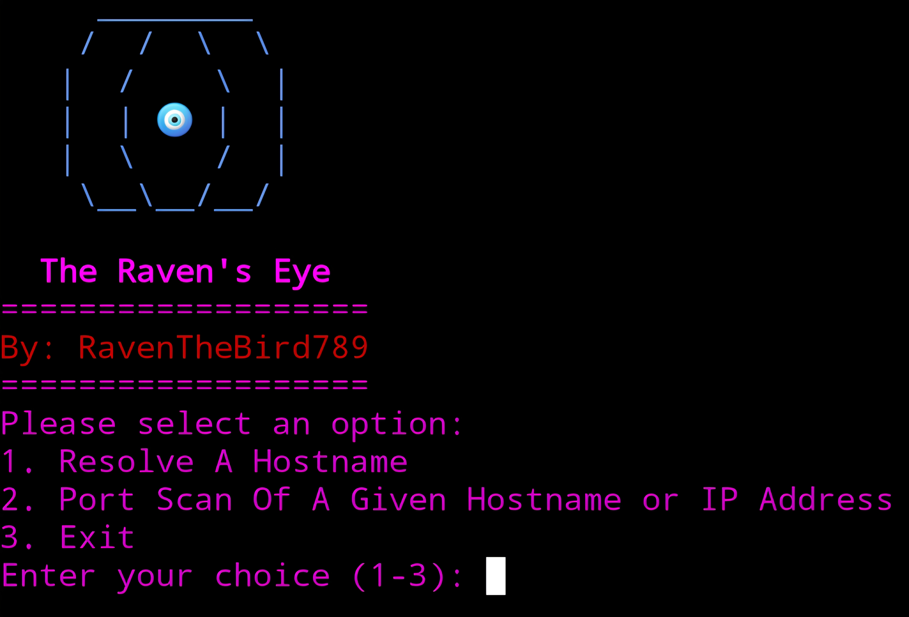

# The-Ravens-Eye 🐦‍⬛🧿
Python script for a hostname resolver and a port scanner for a given hostname or IP Address from the end-user

Requirements:
* Ensure the latest version of python is installed in your terminal (python 3.x)

Recommendations:
* Use a VPN while using this tool (Proton or Mullvad are encouraged)
* Enable TOR in your terminal
* Run proxychains4 while executing the software (This comes pre-installed with Kali-Linux)

Key Terminology:
* Pecking - When the software is actively performing a port scan or resolving a hostname
* Chirping - When the act of port scanning results in the discovery of open ports or resolving a hostname is successful

Installation & Execution:
* To install, simply type "git clone https://github.com/RavenTheBird789/The-Ravens-Eye" in your terminals command line
* To run, simply type "python3 ravens_eye.py" in your terminals command line or use the alias command to create a shortcut to run the program in your terminal such as "alias run="python3 ravens_eye.py""

Note:
* If the input fields for the start and end ports are empty the default values for the port scan with be 1 and 1024 respectively

Updates:
* Built-in python os library utilized to document findings from both resolving hostnames (or IP Addresses) and port scanning processes locally
